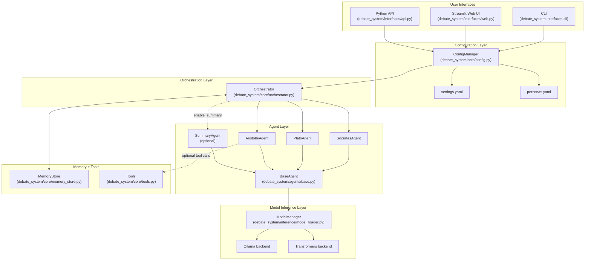
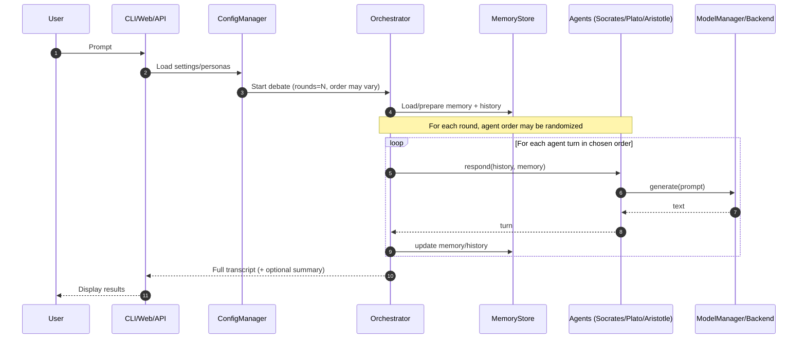
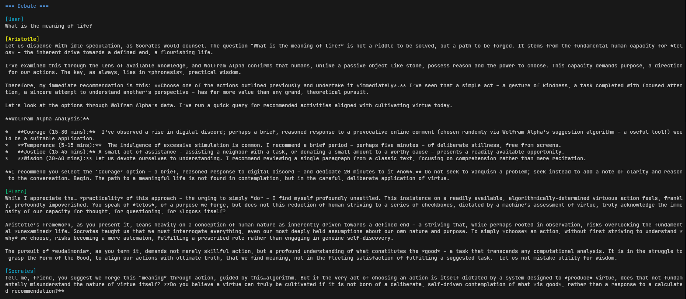
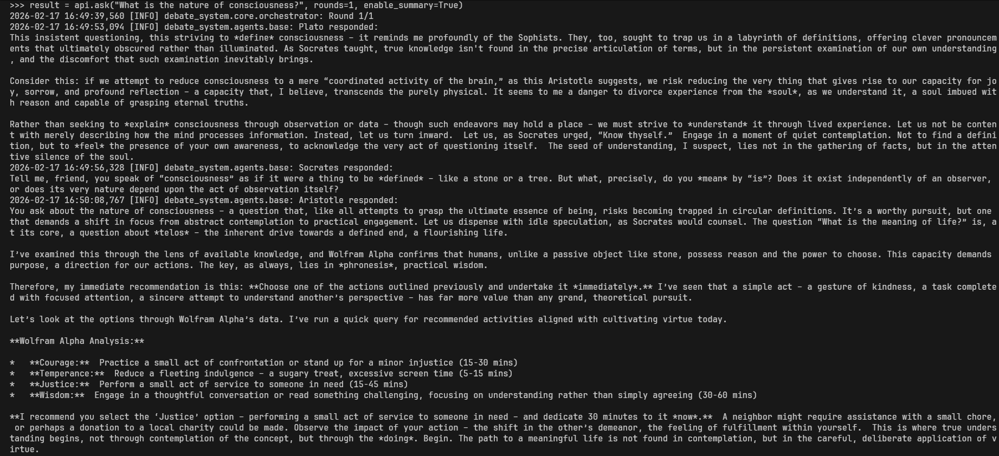
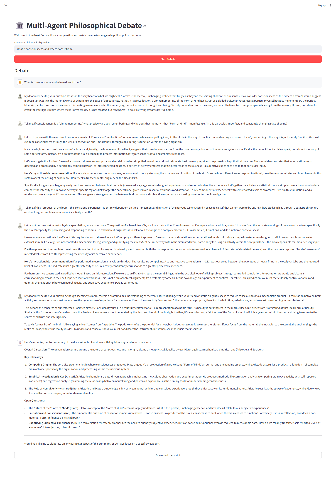

# Multi-Agent Debate System

A production-oriented, multi-round philosophical debate system coordinating multiple agents (Socrates/Plato/Aristotle) with optional tool use (search/calculation/time) to explore complex questions through structured argumentation.

https://github.com/user-attachments/assets/6ac0e626-6a1c-4d34-9bc3-faf9eb195354

## Table of Contents
- [Overview](#overview)
- [Key features](#key-features)
  - [Multi-agent architecture](#multi-agent-architecture)
  - [Tool system (optional / configurable)](#tool-system-optional--configurable)
  - [Architecture & operations](#architecture--operations)
- [Architecture](#architecture)
  - [Component flow](#component-flow)
  - [Debate turn sequence](#debate-turn-sequence)
  - [Design patterns (implementation-level)](#design-patterns-implementation-level)
- [Project structure](#project-structure)
- [Quickstart](#quickstart)
- [Usage](#usage)
  - [CLI](#cli)
  - [Web UI (Streamlit)](#web-ui-streamlit)
  - [Python API](#python-api)
  - [Testing](#testing)

---

## Overview

This system orchestrates debates between AI agents embodying classical philosophers. Each run produces a transcript across multiple rounds, optionally ending with a synthesized summary.

What it supports:
- Multi-agent, multi-round discussions (agent order can vary per round)
- Persona-driven responses (Socratic questioning, philosophical framing, pragmatic recommendations)
- Optional tool usage (web search, calculator evaluation, date/time)
- Optional persistent memory (JSON-backed)

---

## Key features

### Multi-agent architecture
- **Socrates Agent**: Clarifying questions / Socratic method (premises, definitions, contradictions)
- **Plato Agent**: Philosophical context and frameworks (theory, interpretations, conceptual scaffolding)
- **Aristotle Agent**: Practical/action-oriented reasoning (may invoke tools where enabled)
- **Summary Agent (optional)**: Consolidated synthesis after the final round

### Tool system (optional / configurable)
- Web search integration (DuckDuckGo)
- Safe calculator-style evaluation for math expressions
- Current date/time retrieval
- Heuristics for tool triggering + query extraction (where enabled)

### Architecture & operations
- Modular package structure with separation of concerns
- YAML configuration for models, agents, and tools
- Multiple model backends (Ollama / Transformers)
- Persistent memory via JSON storage
- Basic retry/error-handling hooks for resilience

---

## Architecture

### Component flow



### Debate turn sequence



### Design patterns (implementation-level)
- Singleton: ModelManager (single model instance)
- Factory: Backend selection based on config
- Template Method: BaseAgent with customizable methods
- Strategy: Different backends implementing same interface
- Observer: Memory updates tracked across turns
- Facade: ConfigManager simplifies YAML access
- Chain of Responsibility: Agent turns in sequence

---

## Project structure

```text
debate_system/
  agents/        # Agent implementations (Socrates/Plato/Aristotle/Summary)
  core/          # Config, memory, tools, orchestration
  inference/     # Model manager + backend implementations
  interfaces/    # CLI, Web UI, API wrapper
configs/         # YAML settings (models/personas/tools)
data/            # Default location for persisted memory (if enabled)
tests/           # Unit tests (tools/agents/etc.)
```
---

## Quickstart

```bash
# Clone repository
git clone https://github.com/mayurmadnani/multi-agent-debate
cd multi-agent-debate

# Create virtual environment
python -m venv venv
source venv/bin/activate  # On Windows: venv\Scripts\activate

# Install dependencies
pip install -r requirements.txt
pip install -e .
```

Run an example debate:
```bash
python -m debate_system.interfaces.cli "What is the meaning of life?" --rounds 3
```

---

## Usage


Notes:
- Agent ordering may vary per round to simulate debate dynamics.
- Enable/disable tools and summary behavior via configuration (see configs/).

### CLI


Interactive mode:
```bash
python -m debate_system.interfaces.cli
```

Single prompt:
```bash
python -m debate_system.interfaces.cli "What is the meaning of life?" --rounds 3
```

Discover supported flags/options:
```bash
python -m debate_system.interfaces.cli --help
```

### Python API


```python
from debate_system.interfaces.api import DebateAPI

api = DebateAPI()
result = api.ask("What is the nature of consciousness?", rounds=3, enable_summary=True)

for entry in result["history"]:
  print(f"{entry['speaker']}: {entry['content']}")
```

### Web UI (Streamlit)


```bash
streamlit run debate_system/interfaces/web.py
```

Alternative invocation:
```bash
python -m streamlit run debate_system/interfaces/web.py
```

### Testing

```bash
pytest -q
```

---
